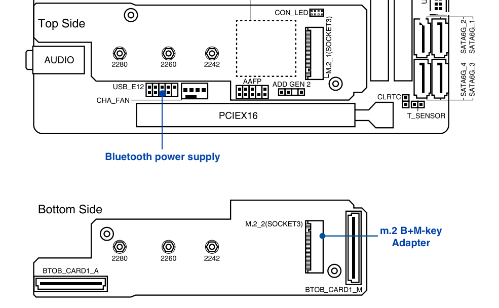
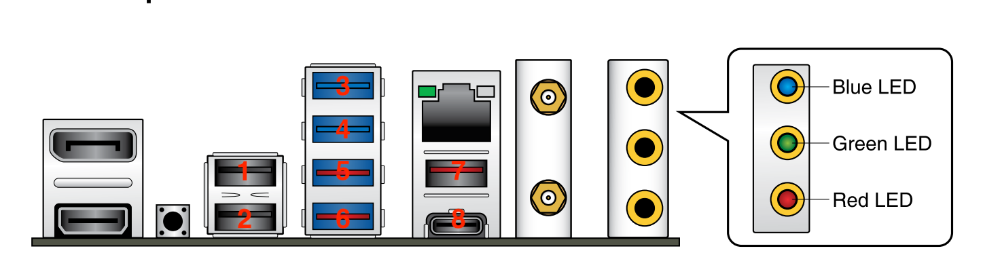
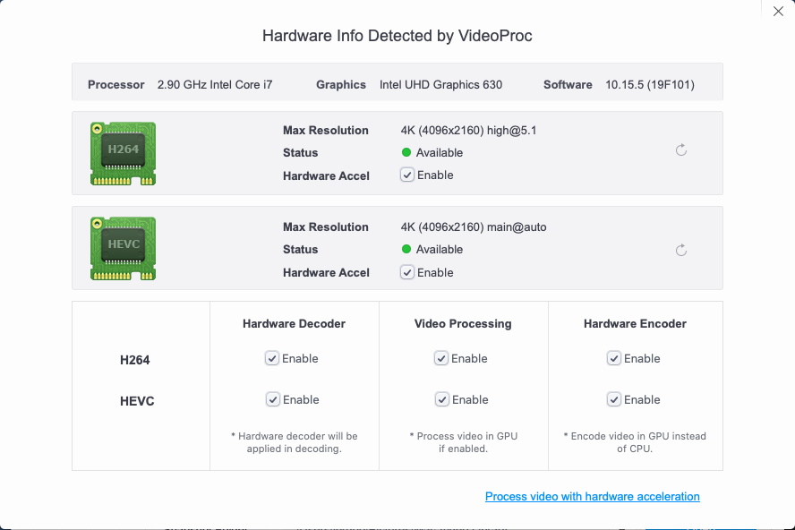
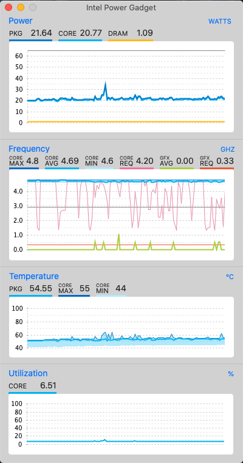

# Hackintosh-ROG-STRIX-Z490I

This repository is about hackintosh on **Asus ROG STRIZX Z490I**. 

**This project is not completely finished yet and a lot of functional test need to be done**, I'v done the basic installation, still working on it since it's not perfect yet. I'm no expert in hackintosh, so this project won't be finished so fast, if someone is interested in this project, your're welcomed to join me.

Anyone has the same board can use the EFI folder directly except the `EFI/OC/config.plist` file, you should generate your own SMBIOS info by following the [Comet Lake Guide](https://dortania.github.io/OpenCore-Desktop-Guide/config.plist/comet-lake.html#platforminfo). Highly recommended reading the whole [OpenCore Desktop Guide](https://dortania.github.io/OpenCore-Desktop-Guide/) before start, and try to build step by step yourself.

## Hardware

* Motherboard: Asus ROG STRIX Z490-I
    * Ethernet: Intel I225-V 2.5Gbit
    * Wi-Fi/BT: Intel AX201NGW
    * Audio: Realtek ALCS1220A
* CPU: Intel i7-10700/10700k
* GPU: Intel UHD630 / AMD Radeon VII
* RAM: Corsair Vengeance LPX DDR4 3200 32GB
* Drive: Samsung 970 EVO Plus

## Software

* Bootloader: OpenCore 0.5.9-debug
* OS: macOS Catalina 10.15.5 (19F96 / 2020-05-26)

## What's working

- [x] Intel UHD630 (iGPU)
- [x] AMD Radeon VII (dGPU)
- [x] Audio Realtek ALCS1220A
- [x] Intel I225-V 2.5Gb Ethernet
- [x] Wi-Fi/BT (BCM94360CS)
- [x] USB
- [ ] Sleep/Wake
- [x] Restart/Shutdown

## Details

### GPU

#### iGPU Intel UHD630

HDMI/DP display and audio output are working fine.

Working by:

* ig-platform-id = `07009B3E`
* device-id = `9B3E0000`

DeviceProperties: 

```xml
<key>PciRoot(0x0)/Pci(0x2,0x0)</key>
<dict>
    <key>AAPL,ig-platform-id</key>
    <data>BwCbPg==</data>
    <key>framebuffer-patch-enable</key>
    <data>AQAAAA==</data>
    <key>framebuffer-stolenmem</key>
    <data>AAAAQA==</data>
    <key>device-id</key>
    <data>mz4AAA==</data>
</dict>
```

#### dGPU AMD Radeon VII

Natively supported, no additional configuration.

### Audio

Working by:

* AppleALC.kext
* FakePCIID.kext
* FakePCIID_Intel_HDMI_Audio.kext
* device-id=`709D0000`
* layout-id=7

DeviceProperties: 

```xml
<key>PciRoot(0x0)/Pci(0x1f,0x3)</key>
<dict>
    <key>layout-id</key>
    <integer>7</integer>
    <key>device-id</key>
    <data>cJ0AAA==</data>
</dict>
```

### Ethernet 

Working by:

* FakePCIID.kext
* FakePCIID_Intel_I225-V.kext
* device-id=`F2150000`

DeviceProperties: 

```xml
<key>PciRoot(0x0)/Pci(0x1C,0x4)/Pci(0x0,0x0)</key>
<dict>
    <key>device-id</key>
    <data>8hUAAA==</data>
</dict>
```

`FakePCIID_Intel_I225-V.kext` is from **SchmockLord**'s repository, details in issue [2.5Gbit Ethernet (Intel I225-V) Don't work #8](https://github.com/SchmockLord/Hackintosh-Intel-i9-10900k-Gigabyte-Z490-Vision-D/issues/8).

### Wi-Fi/BT

Working by using a m.2 B+M-Key adapter with Apple Airport Card BCM94360CS. It's natively supported, airdrop, handoff and sidecar are working perfectly. The bottom side m.2 slot for SSD is occupied and the bottom SSD heat sink must be abandoned.

The bluetooth can not be recognized by default, it uses the onboard 9-pin USB2.0 port for power supply, so USB mapping should be fixed to make it work.




> The onboard wireless network card Intel AX201NGW uses m.2 E-Key slot and CNVi protocol. I tried replace it with a m.2 A-Key BCM94352Z card, the slot is compatible but it didn't work even in windows, thanks to the CNVi thing 😓. So don't try to replace the onboard card.


### USB

All ports are working fine except for the ones disabled due to the 15 port limit.




USB Ports:

| No. | Type | Port |
|-----|------|------|
| 1   | USB 2.0 | HS12 |
| 2   | USB 2.0 | HS13 |
| 3   | USB 3.2 Gen 1 | HS09/SS09 |
| 4   | USB 3.2 Gen 1 | HS10/SS10 |
| 5   | USB 3.2 Gen 2 | HS05/SS05 |
| 6   | USB 3.2 Gen 2 | HS06/SS06 |
| 7   | USB 3.2 Gen 2 | HS03/SS03 |
| 8   | USB 3.2 Gen 2 | HS04/SS04 |
| 9   | USB 2.0 | HS11 |
| 10  | USB 3.2 Gen 2 | HS01/SS01 |
| 11  | USB 3.2 Gen 1 | HS07/SS07 + HS08/SS08 |

> SS04,HS01/SS01,HS07/SS07,HS08/SS08 are not tested.

Here's my choice:


> It’s weird that `HS11` does not appear in macOS by default. I got this port name in windows, and after exporting `USBPorts.kext` by hackintool, I added this port to the `info.plist` file in `USBPorts.kext` package manually.

### BIOS

Version: 0607

### EFI

#### SSDTs

Compiled by following the [ACPI Guide](https://dortania.github.io/Getting-Started-With-ACPI/), the `.dls` SSDT files can be found in SSDTS folder. 

* SSDT-AWAC.aml
* SSDT-EC-USBX.aml
* SSDT-PLUG.aml
* SSDT-SBUS-MCHC.aml

#### Kexts

All kexts with version tag are downloaded from original repositories.

* VirtualSMC.kext `1.1.4`
* SMCProcessor.kext `1.1.4`
* SMCSuperIO.kext `1.1.4`
* Lilu.kext `1.4.5`
* WhateverGreen.kext `1.4.0`
* AppleALC.kext `1.5.0`
* IntelMausi.kext `1.0.3`
* NVMeFix.kext `1.0.2`
* FakePCIID.kext (from RehabMan `2018-1027`)
* FakePCIID_Intel_HDMI_Audio.kext (from RehabMan `2018-1027`)
* FakePCIID_intel_I225-V.kext (from SchmockLord)
* USBPorts.kext (exported by hackintool)

## Misc

### Benchmarks

| Item | Score |
|---|---|
| [CPU - Geekbench](https://browser.geekbench.com/v5/cpu/2603659) | Single/Multi-Core: 1212/8023 |
| [Intel UHD630 - Geekbench](https://browser.geekbench.com/v5/compute/1092240) | OpenCL: 4826 |
| [AMD Radeon VII - Geekbench](https://browser.geekbench.com/v5/compute/1094575) | OpenCL: 49549 |

### Screenshots





## Credits

* [OpenCore Desktop Guide](https://dortania.github.io/OpenCore-Desktop-Guide/)
* [SchmockLord's build on Gigabyte Z490-D](https://github.com/SchmockLord/Hackintosh-Intel-i9-10900k-Gigabyte-Z490-Vision-D)
* [yilmazca's build on Asus Prime Z490-A](https://github.com/yilmazca/intel-i9-10900K-Asus-prime-Z490A-hackintosh)
