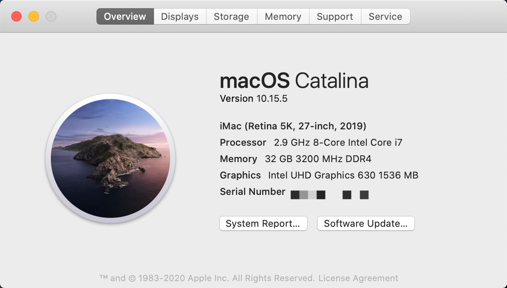
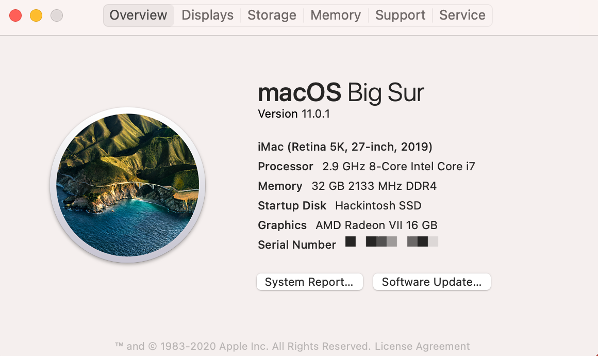

# Hackintosh-ROG-STRIX-Z490I

This repository is about hackintosh on **Asus ROG STRIZX Z490I**. 

**The project is not completely finished yet and a lot of functional test need to be done**, I'v done the basic installation, still working on it since it's not perfect yet. I'm no expert in hackintosh, so this project won't be finished so fast, if someone is interested in this project, your're welcomed to join me.

Anyone has the same board can use the EFI folder directly except the `EFI/OC/config.plist` file, you should generate your own SMBIOS info by following the [Comet Lake Guide](https://dortania.github.io/OpenCore-Desktop-Guide/config.plist/comet-lake.html#platforminfo). Highly recommended reading the whole [OpenCore Desktop Guide](https://dortania.github.io/OpenCore-Desktop-Guide/) before start, and try to build step by step yourself.

## Hardware

* Motherboard: Asus ROG STRIX Z490-I
    * Ethernet: Intel I225-V 2.5Gbit
    * Wi-Fi/BT: Intel AX201NGW
    * Audio: Realtek ALCS1220A
* CPU: Intel i7-10700/10700k
* GPU: Intel UHD630 / AMD Radeon VII
* RAM: Corsair Vengeance LPX DDR4 3200 32GB
* Drive: Samsung 970 EVO Plus

## Software

* Bootloader: OpenCore 0.5.9
* OS: macOS Catalina 10.15.5 (19F96 / 2020-05-26)

## What's working

- [x] Intel UHD630 (iGPU), not perfect
- [x] AMD Radeon VII (dGPU)
- [x] Audio Realtek ALCS1220A
- [x] Intel I225-V 2.5Gb Ethernet
- [x] Wi-Fi/BT (BCM94360CS)
- [ ] USB, mapping need to be fixed
- [ ] Sleep/Wake
- [x] Reboot/Shutdown

## Details

### GPU

**iGPU Intel UHD630**

Just use the default config from OpenCore Desktop Guide.

DeviceProperties: 

```xml
<key>PciRoot(0x0)/Pci(0x2,0x0)</key>
<dict>
    <key>AAPL,ig-platform-id</key>
    <data>BwCbPg==</data>
    <key>framebuffer-patch-enable</key>
    <data>AQAAAA==</data>
    <key>framebuffer-stolenmem</key>
    <data>AAAwAQ==</data>
</dict>
```

HDMI display output is working, didn't test DP and monitor audio yet. Since the system audio is fixed, I think monitor audio will work too. Sadly, I found some software will panic when using iGPU HDMI, such as `System Preference -> Users&Groups` and `Wechat`, I don't knonw what's wrong and didn't do much test yet.

**dGPU AMD Radeon VII**, natively supported, everything is fine.




### Ethernet 

Working by:

* FakePCIID.kext
* FakePCIID_Intel_I225-V.kext
* device-id=`F2150000`

DeviceProperties: 

```xml
<key>PciRoot(0x0)/Pci(0x1C,0x4)/Pci(0x0,0x0)</key>
<dict>
    <key>device-id</key>
    <data>8hUAAA==</data>
</dict>
```

I found `FakePCIID_Intel_I225-V.kext` from **SchmockLord**'s repository, details in [Issue 2.5Gbit Ethernet (Intel I225-V) Don't work #8](https://github.com/SchmockLord/Hackintosh-Intel-i9-10900k-Gigabyte-Z490-Vision-D/issues/8).

### Wi-Fi/BT

Working by using a m.2 B+M-Key adapter with Apple Airport Card BCM94360CS. It's natively supported, airdrop, handoff and sidecar are working perfectly.

The onboard wireless network card Intel AX201NGW uses m.2 E-Key slot and CNVi protocol. I tried replace it with a m.2 A-Key BCM94352Z card, the slot is compatible but it didn't work even in windows, thanks to the CNVi thing 😓. At last, I used a m.2 B+M-Key adapter with Apple Airport Card BCM94360CS, Wi-Fi/BT is working perfect now. Sadly, I have to give up a m.2 slot for SSD and the onboard ssd heat sink, while now I have two wireless network cards, one for macOS and one for windows.

The bluetooth can not be recognized by default, because it uses an onboard USB2.0 port for power supply, so USB mapping should be fixed first.

### USB

Actually I've done the USB mapping, but not perfect yet. I'm a little confused about the result. I followed the [USB Mapping Guide](https://dortania.github.io/USB-Map-Guide/) step by step, and got the `USBMap.kext`, but after reboot, the port name is not exactly the same as before the mapping. I'll keep trying.

For now, I’m sure the onboard USB2.0 port which bluetooth use is `HS13`, I mapped it to USB2.0 type to make bluetooth work. What I'm also confused is this port has the name `HS11` in windows, but there's no `HS11` in macOS, and the USB2.0 port on the IO panel also share the name `HS13`🤔. Can anyone explain to me ?

### Audio ALC

Working by:

* AppleALC.kext
* FakePCIID.kext
* FakePCIID_Intel_HDMI_Audio.kext
* device-id=`709D0000`
* layout-id=7

DeviceProperties: 

```xml
<key>PciRoot(0x0)/Pci(0x1f,0x3)</key>
<dict>
    <key>layout-id</key>
    <integer>7</integer>
    <key>device-id</key>
    <data>cJ0AAA==</data>
</dict>
```

At the beginning, I've tried every layout-id from the AppleALC support list, audio device info was correct in system, but audio output just didn't work. Luckily I found **yilmazca's build**, we share almost the same onboard hardware.

## EFI

### SSDTs

Compiled by following the [ACPI Guide](https://dortania.github.io/Getting-Started-With-ACPI/), the `.dls` SSDT files can be found in SSDTS folder. According to the guide, SSDT-PMC is used for NVRAM support, but desktop Z490 boards **DO NOT** need it, so it's not included in ACPI. 

* SSDT-AWAC.aml
* SSDT-EC-USBX.aml
* SSDT-PLUG.aml
* SSDT-SBUS-MCHC.aml

### Kexts

All kexts with version tag are downloaded from original repositories.

* VirtualSMC.kext `1.1.4`
* SMCProcessor.kext `1.1.4`
* SMCSuperIO.kext `1.1.4`
* Lilu.kext `1.4.5`
* WhateverGreen.kext `1.4.0`
* AppleALC.kext `1.5.0`
* IntelMausi.kext `1.0.3`
* NVMeFix.kext `1.0.2`
* FakePCIID.kext (from RehabMan `2018-1027`)
* FakePCIID_Intel_HDMI_Audio.kext (from RehabMan `2018-1027`)
* FakePCIID_intel_I225-V.kext (from SchmockLord)

## Credits

* [OpenCore Desktop Guide](https://dortania.github.io/OpenCore-Desktop-Guide/)
* [SchmockLord's build on Gigabyte Z490-D](https://github.com/SchmockLord/Hackintosh-Intel-i9-10900k-Gigabyte-Z490-Vision-D)
* [yilmazca's build on Asus Prime Z490-A](https://github.com/yilmazca/intel-i9-10900K-Asus-prime-Z490A-hackintosh)
